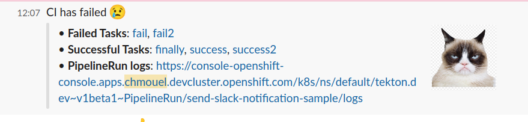
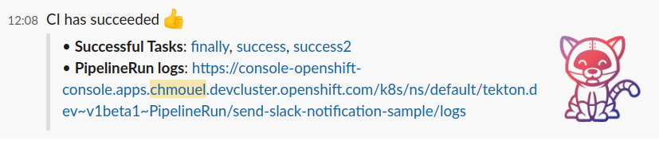

# Tekton Slack Task Status

This task try to detect a pipelineRun status and automatically send a slack
message with a log link. This is usually used in a
[`finally`](https://github.com/tektoncd/pipeline/blob/main/docs/pipelines.md#adding-finally-to-the-pipeline)
pipeline section.

## Parameters

* **slack-webhook-secret-name**: The secret name where the webhook url is
  stored.

* **slack-webhook-secret-key**: The key inside the secret name where the webhook
  url is stored.

* **failure url image**: The failure url image

* **success url image**: The success url image

* **success text**: The text printed when there is a successfull run.

* **failure text**: The text printed when there is a failure run.

* **log_url**: Set this to your log server as prefix.
  * example: <https://console-openshift-console.apps.mycluster.openshift.com>)

* **openshift**: Set this `true` if you are on OpenShift, it will
  try to detect the log_url if it wasn't set by getting the openshift console
  route and construct the URL. If you don't have access to the openshift console
  route namespace then set the `log_url` to it and it will append the url
  to the pipelinerun log for openshift.
  * example: `"true"`

### Example

See this sample pipeline here: [./samples/pipelinerun.yaml](./samples/pipelinerun.yaml)

This is how it looks by default on failure :

and on success :

### Authors

* Chmouel Boudjnah <chmouel@chmouel.com>
